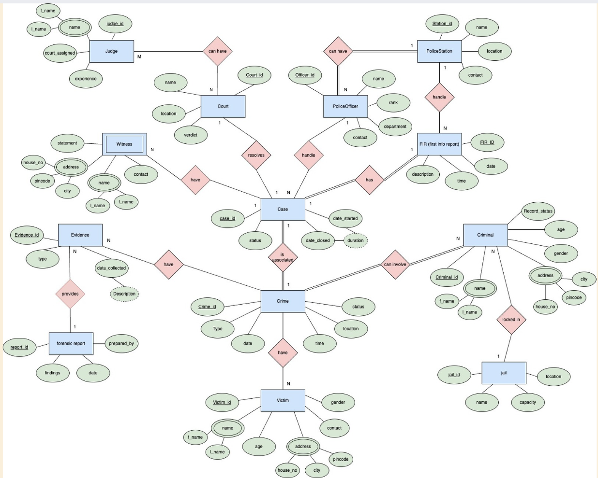

# Crime-Management-System
 
Developed using SQL and Java
The Crime Management System (CMS) is designed to maintain and track crime-related records, including criminal profiles, cases, evidence, victims, and witness statements. This system aims to digitize crime records for easy accessibility, efficient data management, and enhanced security.
 
 
The Crime Management System is a powerful tool for modernizing law enforcement.
It offers:
Faster case processing through digital records
Improved security with centralized crime data storage
Better tracking & analytics for crime trends
This system ensures efficient and secure management of crime records, helping authorities maintain law and order effectively.
 
 
